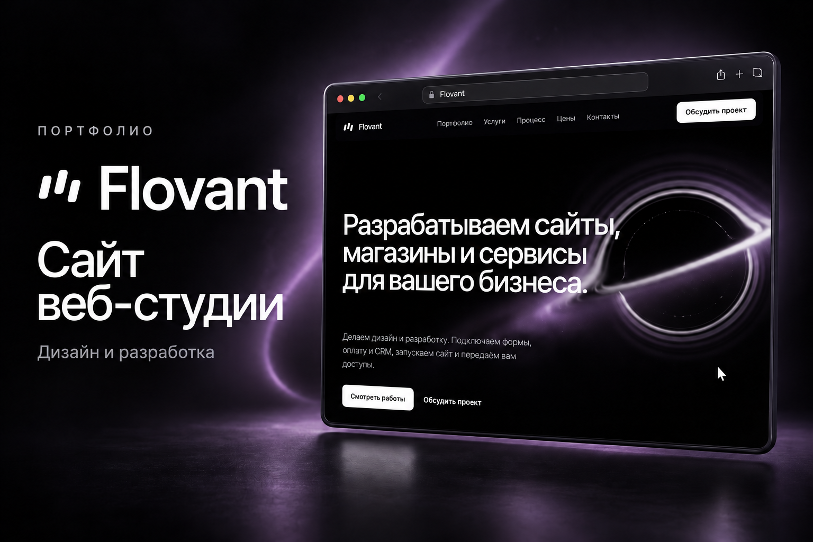
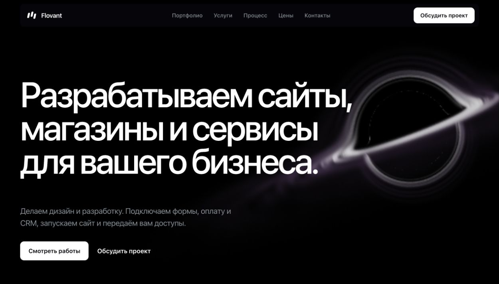
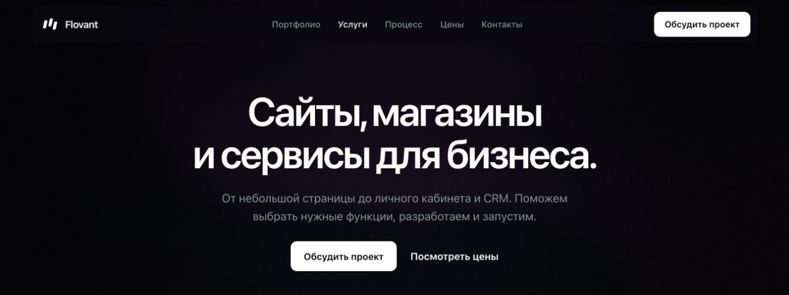
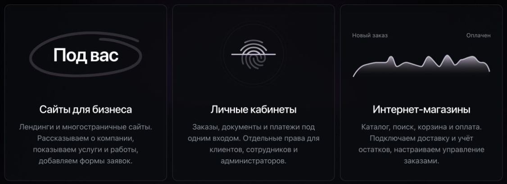
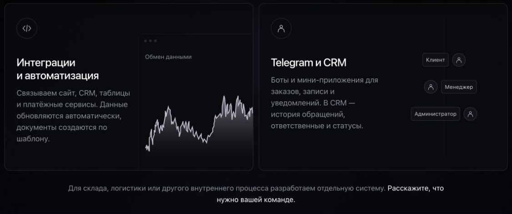
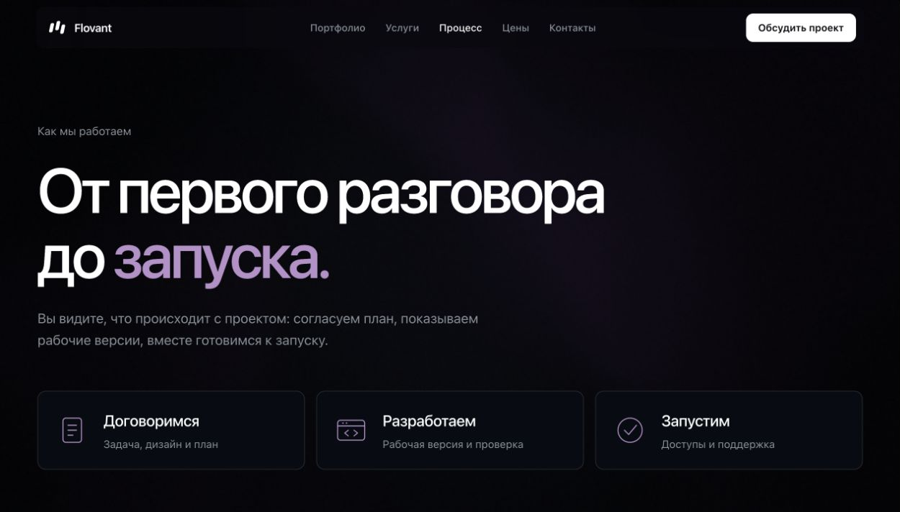
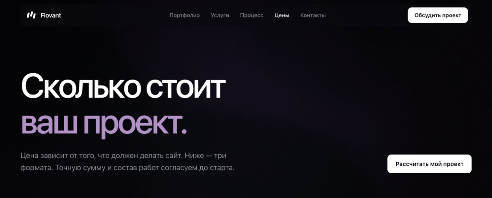
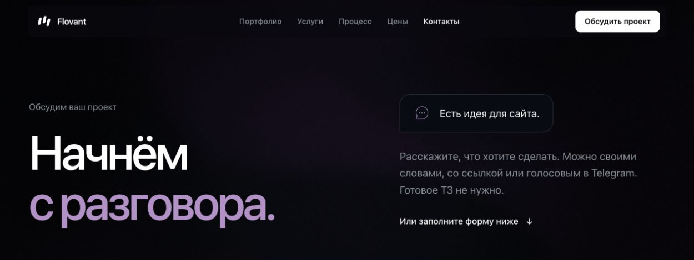

# Flovant

### ИТ-студия: сайты, Telegram-продукты и системы для бизнеса

## О студии

**Flovant** занимается дизайном и разработкой цифровых продуктов для бизнеса. Создаём сайты, интернет-магазины, личные кабинеты, Telegram-ботов и мини-приложения. Разрабатываем CRM и внутренние системы, подключаем оплату и внешние сервисы, автоматизируем работу с заявками и данными.

Помогаем пройти весь путь: от обсуждения задачи и выбора функций до дизайна, разработки, проверки и запуска. Показываем рабочие версии по ссылке, собираем обратную связь и после запуска передаём доступы и инструкции.

Работаем с командами по всей России — обсуждаем проекты по видеосвязи и в переписке.

## Что мы делаем

| Направление | Задачи |
| --- | --- |
| **Сайты для бизнеса** | Лендинги, сайты компаний, страницы услуг и портфолио с формами заявок. |
| **Интернет-магазины** | Каталог, поиск, фильтры, корзина, оплата, доставка и управление заказами. |
| **Личные кабинеты** | Заказы, документы и платежи с отдельными правами для клиентов, сотрудников и администраторов. |
| **Telegram-продукты** | Боты и мини-приложения для записи, заказов и уведомлений. |
| **CRM и внутренние системы** | История обращений, ответственные сотрудники, статусы и инструменты для работы команды. |
| **Интеграции и автоматизация** | Связь сайта с CRM, таблицами, платёжными сервисами и внешними API; передача данных и создание документов. |

## Как проходит работа

1. **Обсуждаем задачу.** Изучаем бизнес, аудиторию, нужные функции, бюджет и сроки.
2. **Согласуем решение.** Определяем состав работ, готовим прототип и дизайн, фиксируем этапы и стоимость.
3. **Разрабатываем и проверяем.** Показываем готовые части, собираем замечания, тестируем страницы и функции на разных устройствах.
4. **Запускаем и передаём.** Подключаем рабочий домен и сервисы, передаём доступы и показываем, как пользоваться проектом.

## Видео

Два презентационных ролика о сайте Flovant: плавные переходы, анимация интерфейса, движение курсора и музыкальное сопровождение.

| Ролик | Формат | Параметры | Файл |
| --- | --- | --- | --- |
| **Презентация сайта** | Горизонтальный, 16:9 | 1920 × 1080 · 60 кадров/с · 25 секунд | [Скачать MP4](https://github.com/sunix2131/flovant-studio-showcase/raw/refs/heads/main/media/videos/flovant-presentation-16x9.mp4) |
| **Короткий проморолик** | Вертикальный, 9:16 | 1080 × 1920 · 60 кадров/с · 25 секунд | [Скачать MP4](https://github.com/sunix2131/flovant-studio-showcase/raw/refs/heads/main/media/videos/flovant-promo-9x16.mp4) |

Оба ролика также доступны в папке [media/videos](media/videos).

## Скриншоты сайта

Реальные экраны сайта студии: главная страница, услуги, интеграции, процесс работы, цены и контакты. Изображения сохранены в PNG; разделы с примерами работ в подборку не включены.

### Главная страница

### Услуги

### Сайты, личные кабинеты и интернет-магазины

### Интеграции, автоматизация, Telegram и CRM

### Процесс работы

### Стоимость проекта

### Обсуждение проекта

## Связаться с Flovant

**[Написать в Telegram — @skydipper2708](https://t.me/skydipper2708)**

Расскажите, что хотите сделать. Можно прислать описание своими словами, ссылки или примеры — готовое техническое задание для первого разговора не требуется.

---

Медиа-портфолио Flovant: описание студии, обложка, презентационные видео и скриншоты сайта.
